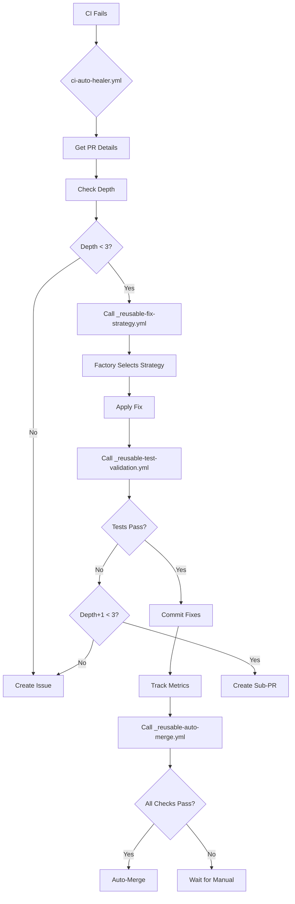

# CI/CD Automation Architecture - OOP Design

## 🏗️ System Overview

Production-grade, self-healing CI/CD system with:
- **Modularity**: Reusable workflow components
- **Observability**: Metrics tracking & analytics
- **Intelligence**: Strategy pattern for fix attempts
- **Automation**: Auto-merge on success
- **Resilience**: Recursive depth limiting

## 📁 Project Structure

```
.github/
├── workflows/
│   ├── ci.yml                          # Main CI pipeline
│   ├── ci-auto-healer.yml             # Orchestrator (NEW - replaces auto-fix-ci-failures.yml)
│   ├── _reusable-fix-strategy.yml     # Reusable: Apply fix strategies
│   ├── _reusable-test-validation.yml  # Reusable: Run tests before commit
│   ├── _reusable-auto-merge.yml       # Reusable: Auto-merge logic
│   └── _reusable-metrics-tracker.yml  # Reusable: Track metrics
├── scripts/
│   ├── fix_strategies/
│   │   ├── __init__.py
│   │   ├── base_strategy.py          # Abstract base class
│   │   ├── black_strategy.py         # Black formatting
│   │   ├── ruff_strategy.py          # Ruff linting
│   │   └── combined_strategy.py      # Run multiple
│   ├── metrics_collector.py          # Metrics storage
│   ├── pr_automator.py               # PR operations
│   └── ci_orchestrator.py            # Main logic
└── data/
    └── ci_metrics.db                  # SQLite metrics DB
```

## 🎯 Design Patterns

### 1. **Strategy Pattern** (Fix Strategies)
```python
class FixStrategy(ABC):
    @abstractmethod
    def can_handle(self, error_type: str) -> bool:
        pass
    
    @abstractmethod
    def apply_fix(self, context: FixContext) -> FixResult:
        pass
    
    @abstractmethod
    def validate_fix(self) -> bool:
        pass
```

### 2. **Factory Pattern** (Strategy Selection)
```python
class StrategyFactory:
    strategies = [
        BlackFormattingStrategy(),
        RuffLintingStrategy(),
        TestValidationStrategy()
    ]
    
    @classmethod
    def get_strategy(cls, error_type: str) -> FixStrategy:
        for strategy in cls.strategies:
            if strategy.can_handle(error_type):
                return strategy
```

### 3. **Observer Pattern** (Metrics)
```python
class MetricsObserver:
    def on_fix_attempt(self, strategy, result):
        # Log to database
        pass
    
    def on_pr_merged(self, pr_number, depth):
        # Track success metrics
        pass
```

### 4. **Chain of Responsibility** (Fix Attempts)
```python
def try_fix_chain(strategies: List[FixStrategy]):
    for strategy in strategies:
        result = strategy.apply_fix()
        if result.success:
            return result
    return None  # All failed
```

## 🔄 Workflow Flow



## 📊 Metrics Schema

### SQLite Database: `ci_metrics.db`

**Table: `fix_attempts`**
```sql
CREATE TABLE fix_attempts (
    id INTEGER PRIMARY KEY,
    pr_number INTEGER,
    strategy_name VARCHAR(50),
    depth INTEGER,
    success BOOLEAN,
    duration_seconds REAL,
    error_type VARCHAR(100),
    created_at TIMESTAMP DEFAULT CURRENT_TIMESTAMP
);
```

**Table: `pr_metrics`**
```sql
CREATE TABLE pr_metrics (
    id INTEGER PRIMARY KEY,
    pr_number INTEGER UNIQUE,
    total_fix_attempts INTEGER DEFAULT 0,
    auto_merged BOOLEAN DEFAULT FALSE,
    max_depth_reached INTEGER DEFAULT 0,
    time_to_fix_seconds REAL,
    created_at TIMESTAMP DEFAULT CURRENT_TIMESTAMP
);
```

**Table: `strategy_performance`**
```sql
CREATE TABLE strategy_performance (
    strategy_name VARCHAR(50) PRIMARY KEY,
    total_attempts INTEGER DEFAULT 0,
    successful_attempts INTEGER DEFAULT 0,
    success_rate REAL GENERATED ALWAYS AS (successful_attempts * 1.0 / total_attempts),
    avg_duration_seconds REAL
);
```

## 🔧 Reusable Workflows

### `_reusable-fix-strategy.yml`
**Inputs:**
- `error_type`: "black" | "ruff" | "pytest"
- `pr_branch`: Branch to fix
- `depth`: Current recursion depth

**Outputs:**
- `success`: boolean
- `files_changed`: list
- `duration_seconds`: number

### `_reusable-test-validation.yml`
**Inputs:**
- `test_command`: Command to run (default: pytest)
- `timeout_minutes`: Max test runtime

**Outputs:**
- `tests_passed`: boolean
- `test_output`: string

### `_reusable-auto-merge.yml`
**Inputs:**
- `pr_number`: PR to merge
- `require_reviews`: boolean
- `merge_method`: "squash" | "merge" | "rebase"

**Outputs:**
- `merged`: boolean
- `merge_sha`: string

## 🎓 Benefits Over Previous Version

### ✅ Modular
- Each workflow has single responsibility
- Easy to test/update individually
- Reusable across repos

### ✅ Observable
- Tracks all fix attempts
- Stores metrics in SQLite
- Generates performance reports

### ✅ Intelligent
- Strategy pattern allows easy addition of new fixers
- Learns which strategies work best
- Can prioritize based on success rate

### ✅ Complete Loop
- Auto-merge on success
- Closes related issues
- Updates parent PRs

### ✅ Test-Safe
- Always validates fixes work
- Never pushes breaking changes
- Runs full test suite

## 📈 Analytics Dashboard (Future)

Generate weekly reports:
```bash
python .github/scripts/generate_report.py --week
```

**Output:**
- Fix success rate by strategy
- Average time to fix
- Most common error types
- Depth distribution
- Auto-merge success rate

## 🚀 Migration Path

1. **Phase 1** (Current): Create reusable workflows
2. **Phase 2**: Implement strategy classes in Python
3. **Phase 3**: Add metrics tracking
4. **Phase 4**: Implement auto-merge logic
5. **Phase 5**: Replace old `auto-fix-ci-failures.yml`
6. **Phase 6**: Add analytics/reporting

## 🔒 Security Considerations

- Use GitHub's built-in `GITHUB_TOKEN` (auto-rotated)
- Never store credentials in metrics DB
- Validate all external inputs
- Limit auto-merge to specific labels
- Require manual approval at depth 3

---

**Status**: 🟡 Design Complete - Implementation Pending
**Next Step**: Create reusable workflow components
