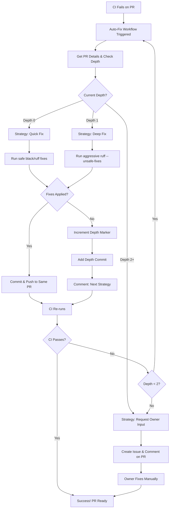

# CI/CD Automation Architecture - Progressive Fix Strategy

## 🏗️ System Overview

Production-grade, self-healing CI/CD system with:
- **Progressive Strategy**: Three-tier fix approach (quick → deep → owner input)
- **In-Place Fixes**: No recursive PRs - all fixes within the same PR
- **Modularity**: Reusable workflow components
- **Observability**: Metrics tracking & analytics
- **Intelligence**: Strategy pattern for fix attempts
- **Resilience**: Depth limiting with owner notification

## 🎯 Progressive Fix Strategy

When CI fails on a PR, the auto-fix workflow applies a **three-tier progressive strategy**:

### 1️⃣ **Quick Fix (Attempt 1/3)**
- **Strategy**: Safe, standard auto-formatting
- **Tools**:
  - `black .` (standard formatting)
  - `ruff check . --fix` (safe fixes only)
- **Goal**: Fix simple formatting and linting issues quickly
- **If successful**: Commits fixes and triggers CI re-run
- **If fails**: Increments depth marker and waits for next CI failure

### 2️⃣ **Deep Fix (Attempt 2/3)**
- **Strategy**: Aggressive transformations with unsafe fixes
- **Tools**:
  - `black . --verbose` (detailed formatting)
  - `ruff check . --fix --unsafe-fixes --show-fixes` (aggressive fixes)
- **Goal**: Apply more aggressive automated fixes
- **If successful**: Commits fixes and triggers CI re-run
- **If fails**: Increments depth marker and waits for next CI failure

### 3️⃣ **Request Owner Input (Attempt 3/3)**
- **Strategy**: Create issue and notify owner
- **Actions**:
  - Creates GitHub issue with `manual-fix-required` label
  - Comments on PR with detailed explanation
  - Lists all attempted strategies
  - Provides CI logs link
- **Goal**: Escalate to human intervention
- **Result**: Owner must manually fix the issues

## 🔑 Key Design Principles

### ✅ **No Recursive PRs**
- All fix attempts happen **within the same PR**
- No sub-PRs or nested branches created
- Depth tracking via commit message markers: `[auto-fix-depth-N]`

### 🔄 **Self-Conversation Loop**
- Workflow communicates progress via PR comments
- Each attempt posts a status update
- Failed attempts explain what was tried and what's next
- Transparent process for developers

## 📁 Project Structure

```
.github/
├── workflows/
│   ├── ci.yml                          # Main CI pipeline
│   ├── ci-auto-healer.yml             # Orchestrator (NEW - replaces auto-fix-ci-failures.yml)
│   ├── _reusable-fix-strategy.yml     # Reusable: Apply fix strategies
│   ├── _reusable-test-validation.yml  # Reusable: Run tests before commit
│   ├── _reusable-auto-merge.yml       # Reusable: Auto-merge logic
│   └── _reusable-metrics-tracker.yml  # Reusable: Track metrics
├── scripts/
│   ├── fix_strategies/
│   │   ├── __init__.py
│   │   ├── base_strategy.py          # Abstract base class
│   │   ├── black_strategy.py         # Black formatting
│   │   ├── ruff_strategy.py          # Ruff linting
│   │   └── combined_strategy.py      # Run multiple
│   ├── metrics_collector.py          # Metrics storage
│   ├── pr_automator.py               # PR operations
│   └── ci_orchestrator.py            # Main logic
└── data/
    └── ci_metrics.db                  # SQLite metrics DB
```

## 🎯 Design Patterns

### 1. **Strategy Pattern** (Fix Strategies)
```python
class FixStrategy(ABC):
    @abstractmethod
    def can_handle(self, error_type: str) -> bool:
        pass
    
    @abstractmethod
    def apply_fix(self, context: FixContext) -> FixResult:
        pass
    
    @abstractmethod
    def validate_fix(self) -> bool:
        pass
```

### 2. **Factory Pattern** (Strategy Selection)
```python
class StrategyFactory:
    strategies = [
        BlackFormattingStrategy(),
        RuffLintingStrategy(),
        TestValidationStrategy()
    ]
    
    @classmethod
    def get_strategy(cls, error_type: str) -> FixStrategy:
        for strategy in cls.strategies:
            if strategy.can_handle(error_type):
                return strategy
```

### 3. **Observer Pattern** (Metrics)
```python
class MetricsObserver:
    def on_fix_attempt(self, strategy, result):
        # Log to database
        pass
    
    def on_pr_merged(self, pr_number, depth):
        # Track success metrics
        pass
```

### 4. **Chain of Responsibility** (Fix Attempts)
```python
def try_fix_chain(strategies: List[FixStrategy]):
    for strategy in strategies:
        result = strategy.apply_fix()
        if result.success:
            return result
    return None  # All failed
```

## 🔄 Workflow Flow



## 📊 Depth Tracking Mechanism

The workflow tracks attempt depth using **commit message markers**:

1. **Initial attempt** (Depth 0): No marker in commits
2. **After first failure**: Adds commit with `[auto-fix-depth-1]` marker
3. **After second failure**: Adds commit with `[auto-fix-depth-2]` marker
4. **Depth detection**: Scans last 10 commits for most recent `[auto-fix-depth-N]` marker

### Example Commit History
```
abc123 - feat: add new feature
def456 - fix(auto): apply ruff fixes using quick_fix strategy [attempt: 1/3]
ghi789 - chore(auto-fix): increment depth to 1 for next attempt
         [auto-fix-depth-1]
jkl012 - fix(auto): apply ruff fixes using deep_fix strategy [attempt: 2/3]
mno345 - chore(auto-fix): increment depth to 2 for next attempt
         [auto-fix-depth-2]
```

## 📊 Metrics Schema

### SQLite Database: `ci_metrics.db`

**Table: `fix_attempts`**
```sql
CREATE TABLE fix_attempts (
    id INTEGER PRIMARY KEY,
    pr_number INTEGER,
    strategy_name VARCHAR(50),
    depth INTEGER,
    success BOOLEAN,
    duration_seconds REAL,
    error_type VARCHAR(100),
    created_at TIMESTAMP DEFAULT CURRENT_TIMESTAMP
);
```

**Table: `pr_metrics`**
```sql
CREATE TABLE pr_metrics (
    id INTEGER PRIMARY KEY,
    pr_number INTEGER UNIQUE,
    total_fix_attempts INTEGER DEFAULT 0,
    auto_merged BOOLEAN DEFAULT FALSE,
    max_depth_reached INTEGER DEFAULT 0,
    time_to_fix_seconds REAL,
    created_at TIMESTAMP DEFAULT CURRENT_TIMESTAMP
);
```

**Table: `strategy_performance`**
```sql
CREATE TABLE strategy_performance (
    strategy_name VARCHAR(50) PRIMARY KEY,
    total_attempts INTEGER DEFAULT 0,
    successful_attempts INTEGER DEFAULT 0,
    success_rate REAL GENERATED ALWAYS AS (successful_attempts * 1.0 / total_attempts),
    avg_duration_seconds REAL
);
```

## 🔧 Reusable Workflows

### `_reusable-fix-strategy.yml`
**Inputs:**
- `error_type`: "black" | "ruff" | "pytest"
- `pr_branch`: Branch to fix
- `depth`: Current recursion depth

**Outputs:**
- `success`: boolean
- `files_changed`: list
- `duration_seconds`: number

### `_reusable-test-validation.yml`
**Inputs:**
- `test_command`: Command to run (default: pytest)
- `timeout_minutes`: Max test runtime

**Outputs:**
- `tests_passed`: boolean
- `test_output`: string

### `_reusable-auto-merge.yml`
**Inputs:**
- `pr_number`: PR to merge
- `require_reviews`: boolean
- `merge_method`: "squash" | "merge" | "rebase"

**Outputs:**
- `merged`: boolean
- `merge_sha`: string

## 🎓 Benefits Over Previous Version

### ✅ No Recursive PRs
- **Before**: Created sub-PRs for each fix attempt, leading to PR sprawl
- **After**: All fixes happen in the same PR, keeping the workflow clean

### ✅ Progressive Intelligence
- **Before**: Single fix strategy (unsafe fixes always)
- **After**: Three-tier approach - start simple, get aggressive, then escalate

### ✅ Clear Communication
- **Before**: Silent failures or confusing sub-PR chains
- **After**: PR comments explain each attempt and next steps

### ✅ Owner Engagement
- **Before**: Could create infinite sub-PRs
- **After**: Explicitly requests owner input after 2 automated attempts

### ✅ Transparent Process
- **Before**: Hard to track what was tried
- **After**: Commit messages and comments document every attempt

### ✅ Self-Contained
- **Before**: Required tracking across multiple PRs
- **After**: Single PR contains entire fix history

## 📈 Analytics Dashboard (Future)

Generate weekly reports:
```bash
python .github/scripts/generate_report.py --week
```

**Output:**
- Fix success rate by strategy
- Average time to fix
- Most common error types
- Depth distribution
- Auto-merge success rate

## 🚀 Migration Path

1. **Phase 1** (Current): Create reusable workflows
2. **Phase 2**: Implement strategy classes in Python
3. **Phase 3**: Add metrics tracking
4. **Phase 4**: Implement auto-merge logic
5. **Phase 5**: Replace old `auto-fix-ci-failures.yml`
6. **Phase 6**: Add analytics/reporting

## 🔒 Security Considerations

- Use GitHub's built-in `GITHUB_TOKEN` (auto-rotated)
- Never store credentials in metrics DB
- Validate all external inputs
- Limit auto-merge to specific labels
- Require manual approval at depth 3

---

**Status**: 🟢 **Implemented** - Progressive fix strategy active
**Current Version**: `auto-fix-ci-failures.yml` with three-tier progressive strategy
**Next Steps**: Monitor effectiveness and adjust strategies as needed

## 📝 Implementation Notes

### What Changed (2026-03-07)
1. ✅ Removed recursive PR creation logic
2. ✅ Implemented three-tier progressive fix strategy
3. ✅ Added depth tracking via commit message markers
4. ✅ Added PR comments for transparency
5. ✅ Updated max attempts from 3 to 2 (plus owner notification)
6. ✅ All fixes now happen within the same PR

### Migration Notes
- **Old behavior**: Created sub-PRs for each fix attempt
- **New behavior**: In-place fixes with progressive strategies
- **Breaking change**: No sub-PRs means simpler PR graph but different tracking
- **Backward compatible**: Existing PRs will use new strategy on next CI failure
